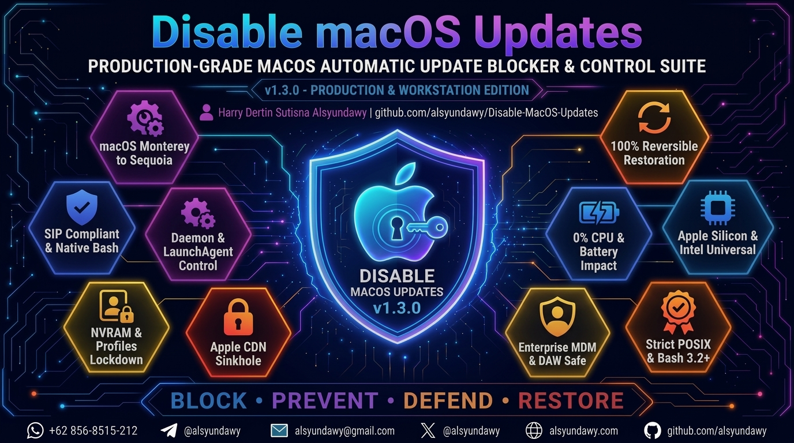

<!-- markdownlint-disable-file MD033 -->

# Operations & Administration Manual

<p align="center">
  <a href="https://github.com/alsyundawy/Disable-MacOS-Updates">
    
  </a>
</p>

**Disable-MacOS-Updates Suite — v1.3.0**<br>
_Operations Manual for macOS Automatic Software Update Control_

---

## 🧭 Table of Contents

- [1. Summary & Purpose](#1-summary--purpose)
- [2. System Requirements & Compatibility](#2-system-requirements--compatibility)
- [3. Operational Procedures](#3-operational-procedures)
  - [3.1 Pre-Flight Health Checklist](#31-pre-flight-health-checklist)
  - [3.2 Disabling macOS Automatic Updates](#32-disabling-macos-automatic-updates)
  - [3.3 Restoring macOS Automatic Updates](#33-restoring-macos-automatic-updates)
  - [3.4 Post-Flight Verification Runbook](#34-post-flight-verification-runbook)
- [4. Technical Mechanics](#4-technical-mechanics)
  - [4.1 Defaults Preference Domains & Keys](#41-defaults-preference-domains--keys)
  - [4.2 Apple Update CDN Sinkholing](#42-apple-update-cdn-sinkholing)
  - [4.3 Blocking Methods Comparison](#43-blocking-methods-comparison)
  - [4.4 Background Launch Daemons Topology](#44-background-launch-daemons-topology)
  - [4.5 Cache Invalidation & Storage Footprint](#45-cache-invalidation--storage-footprint)
- [5. Backup, Integrity & Recovery](#5-backup-integrity--recovery)
  - [5.1 Storage Locations & Permissions](#51-storage-locations--permissions)
  - [5.2 Manual Emergency Recovery Runbook](#52-manual-emergency-recovery-runbook)
- [6. Automation & Fleet Deployment Guides](#6-automation--fleet-deployment-guides)
  - [6.1 Jamf Pro Deployment & Extension Attribute](#61-jamf-pro-deployment--extension-attribute)
  - [6.2 Munki Integration (nopkg Manifest)](#62-munki-integration-nopkg-manifest)
  - [6.3 Kandji & Mosyle Custom Scripts](#63-kandji--mosyle-custom-scripts)
  - [6.4 Ansible Playbook with Handlers](#64-ansible-playbook-with-handlers)
- [7. Troubleshooting & Diagnostics](#7-troubleshooting--diagnostics)
- [8. Frequently Asked Questions (FAQ)](#8-frequently-asked-questions-faq)
- [9. Maintainer & Contact](#9-maintainer--contact)

---

## 1. Summary & Purpose

In audio production (DAW), video editing, or staging environments, unexpected operating system updates can disrupt workflows:

- **Audio Production (DAW)**: Unprompted updates can break CoreAudio driver extensions, PACE iLok authorizations, and AU/VST/AAX audio plugins across Logic Pro, Pro Tools, Ableton Live, and Cubase.
- **Video Rendering & Broadcast**: Overnight reboots abort long render queues in Final Cut Pro, DaVinci Resolve, or Adobe Premiere.
- **Fleet & Staging**: Uncontrolled progression to new major macOS versions can break internal VPN clients, security agents, and corporate device profiles.

**Disable-MacOS-Updates** provides a practical, reversible two-script solution:

1. **`disable_macos_updates.sh`**: Disables background software update discovery, downloads, installation flags, unloads background update daemons, sinkholes Apple update CDN servers in `/etc/hosts`, and purges download caches.
2. **`restore_macos_updates.sh`**: Restores all macOS default update flags, reloads background daemons, cleanses `/etc/hosts` of sinkhole records, flushes DNS caches, and re-triggers an update check.

---

## 2. System Requirements & Compatibility

| Specification             | Requirement / Verified Scope                                                                                                                                                         |
| :------------------------ | :----------------------------------------------------------------------------------------------------------------------------------------------------------------------------------- |
| **Operating System**      | macOS 12 Monterey (12.0–12.7.x), macOS 13 Ventura (13.0–13.7.x), macOS 14 Sonoma (14.0–14.7.x), macOS 15 Sequoia (15.0–15.7.x), macOS 26 Tahoe (26.0+), macOS 27 Golden Gate (27.0+) |
| **Apple Silicon Support** | M1, M2, M3, M4, M5, M6 across Base, Pro, Max, and Ultra tiers                                                                                                                        |
| **Intel x86_64 Support**  | Supported through macOS 26 Tahoe (dropped in macOS 27 Golden Gate)                                                                                                                   |
| **Shell Engine**          | Native macOS `/bin/bash` (v3.2.57+) or modern Bash 4+/5+                                                                                                                             |
| **Privileges**            | Superuser / root execution (`sudo` / interactive password prompt)                                                                                                                    |
| **Dependencies**          | Native macOS utilities (`awk`, `chmod`, `cp`, `defaults`, `dscacheutil`, `find`, `grep`, `killall`, `launchctl`, `mktemp`, `mv`, `rm`, `softwareupdate`, `sw_vers`)                  |

---

## 3. Operational Procedures

### 3.1 Pre-Flight Health Checklist

Before executing the suite on a machine, verify the following baseline prerequisites:

```bash
# 1. Verify root execution permissions (or allow script to prompt automatically)
sudo -v

# 2. Check current macOS version and kernel architecture
sw_vers
uname -m

# 3. Check current /etc/hosts file integrity
ls -la /etc/hosts
```

---

### 3.2 Disabling macOS Automatic Updates

To halt macOS update discovery, background downloads, and automated installs:

#### Method A: Direct Execution via `curl` or `wget` (Zero-Clone)

```bash
# Using native macOS curl
curl -fsSL https://raw.githubusercontent.com/alsyundawy/Disable-MacOS-Updates/main/disable_macos_updates.sh | sudo bash

# Or using wget (if installed)
wget -qO- https://raw.githubusercontent.com/alsyundawy/Disable-MacOS-Updates/main/disable_macos_updates.sh | sudo bash
```

#### Method B: Local Git Repository Execution

```bash
# 1. Navigate to the script location
cd /path/to/Disable-MacOS-Updates

# 2. Make scripts executable (if needed)
chmod +x disable_macos_updates.sh restore_macos_updates.sh

# 3. Execute (no sudo prefix needed — script automatically prompts for sudo password)
./disable_macos_updates.sh

# Or execute with explicit sudo
sudo ./disable_macos_updates.sh
```

#### Step-by-Step Execution Sequence

1. **Preflight Validation**: Validates EUID (automatically triggers interactive `sudo` password prompt if run as non-root from local file, or halts safely if piped without root), confirms Darwin OS kernel, validates Bash 3.2+, and verifies presence of all required native binaries (`awk`, `chmod`, `cp`, `defaults`, `dscacheutil`, `find`, `grep`, `killall`, `launchctl`, `mktemp`, `mv`, `rm`, `sw_vers`).
2. **Step 1/6 — Baseline Backup**: Records initial `com.apple.SoftwareUpdate` and `com.apple.commerce` values to `/var/db/disable_macos_updates_prefs.bak` with `0600 root:wheel` permissions (preserves original baseline on repeated runs).
3. **Step 2/6 — Defaults Enforcement**: Writes `false` to all automatic check, download, install, configuration data, and App Store preferences (`com.apple.SoftwareUpdate` and `com.apple.commerce` / `com.apple.Commerce`).
4. **Step 3/6 — Daemon Unloading**: Unloads all 6 background update daemons (`com.apple.softwareupdated`, `com.apple.mobile.softwareupdated`, `com.apple.InstallAssistantService`, `com.apple.storedownloadd`, `com.apple.storekitagentd`, `com.apple.commerce`) via modern `launchctl bootout`.
5. **Step 4/6 — Cache Purging**: Safely purges the `/Library/Updates/` staging directory using `find /Library/Updates -mindepth 1 -delete` without removing the parent directory or exceeding shell argument limits.
6. **Step 5/6 — CDN Sinkholing**: Captures pristine baseline `/var/db/disable_macos_updates_hosts.bak` and daily backup `/var/db/disable_macos_updates_hosts.bak.YYYYMMDD`, cleans old tagged blocks, and atomically injects loopback records (`127.0.0.1`) for 7 Apple update CDN domains into `/etc/hosts`.
7. **Step 6/6 — DNS Flush**: Flushes local resolver caches via `dscacheutil -flushcache` and `killall -HUP mDNSResponder`.
8. **Verification Summary**: Displays the active preference values and injected `/etc/hosts` sinkhole records in terminal for instant administrator confirmation.

---

### 3.3 Restoring macOS Automatic Updates

To revert all settings back to factory defaults and allow standard updates:

#### Method A: Direct Execution via `curl` or `wget` (Zero-Clone)

```bash
# Using native macOS curl
curl -fsSL https://raw.githubusercontent.com/alsyundawy/Disable-MacOS-Updates/main/restore_macos_updates.sh | sudo bash

# Or using wget (if installed)
wget -qO- https://raw.githubusercontent.com/alsyundawy/Disable-MacOS-Updates/main/restore_macos_updates.sh | sudo bash
```

#### Method B: Local Git Repository Execution

```bash
# Execute (no sudo prefix needed — script automatically prompts for sudo password)
./restore_macos_updates.sh

# Or execute with explicit sudo
sudo ./restore_macos_updates.sh
```

#### Step-by-Step Restoration Sequence

1. **Preflight Validation**: Validates EUID (auto-elevates with password prompt if run from local file), confirms Darwin OS kernel, validates Bash 3.2+, and verifies required binaries (`awk`, `chmod`, `cp`, `defaults`, `dscacheutil`, `grep`, `killall`, `launchctl`, `mktemp`, `mv`, `rm`, `softwareupdate`, `sw_vers`).
2. **Step 1/5 — Defaults Re-enabling**: Sets all update flags back to `-bool true` on `com.apple.SoftwareUpdate` and `com.apple.commerce` (including `com.apple.Commerce`). Displays original values from baseline backup for reference.
3. **Step 2/5 — Hosts Cleaning**: Creates pre-restore backup `/var/db/restore_macos_updates_hosts_YYYYMMDD_HHMMSS.bak`, strips all lines tagged with `# disable_macos_updates:managed` and header blocks from `/etc/hosts` in a single-pass BSD `awk` pipeline, and commits changes atomically via `rename(2)`.
4. **Step 3/5 — Daemon Reloading**: Bootstraps and kickstarts all 6 background launch daemons (`com.apple.softwareupdated`, `com.apple.mobile.softwareupdated`, `com.apple.InstallAssistantService`, `com.apple.storedownloadd`, `com.apple.storekitagentd`, `com.apple.commerce`).
5. **Step 4/5 — DNS Cache Flush**: Flushes resolver cache via `dscacheutil -flushcache` and `killall -HUP mDNSResponder` to restore clean network resolution to Apple update CDN servers.
6. **Step 5/5 — Update Check**: Triggers `softwareupdate --list` to populate and verify update catalog availability.
7. **Verification Summary**: Validates current preferences and confirms 0 managed sinkhole entries remain in `/etc/hosts`.

---

### 3.4 Post-Flight Verification Runbook

You can inspect the current status at any time using standard terminal commands:

```bash
# 1. Check SoftwareUpdate preferences (all should be 0 / false when disabled)
defaults read /Library/Preferences/com.apple.SoftwareUpdate

# 2. Check App Store commerce preferences (should be 0 / false when disabled)
defaults read /Library/Preferences/com.apple.commerce AutoUpdate

# 3. Check /etc/hosts sinkhole entries (should show 7 managed records when disabled)
grep "disable_macos_updates:managed" /etc/hosts

# 4. Verify DNS resolution of update CDN
dscacheutil -q host -a name swscan.apple.com
# Expected output when disabled: 127.0.0.1
# Expected output when restored: Official Apple Akamai / Cloudflare CDN IP
```

---

## 4. Technical Mechanics

### 4.1 Defaults Preference Domains & Keys

The scripts manipulate system-level preference plists located in `/Library/Preferences/`:

| Domain / Plist             | Key Name                           | Disabled Value | Restored Value | Description                                   |
| :------------------------- | :--------------------------------- | :------------- | :------------- | :-------------------------------------------- |
| `com.apple.SoftwareUpdate` | `AutomaticCheckEnabled`            | `false`        | `true`         | Checks for new updates in the background      |
| `com.apple.SoftwareUpdate` | `AutomaticDownload`                | `false`        | `true`         | Downloads update packages automatically       |
| `com.apple.SoftwareUpdate` | `AutomaticallyInstallMacOSUpdates` | `false`        | `true`         | Triggers installation of major/minor updates  |
| `com.apple.SoftwareUpdate` | `ConfigDataInstall`                | `false`        | `true`         | Installs background system configuration data |
| `com.apple.SoftwareUpdate` | `CriticalUpdateInstall`            | `false`        | `true`         | Installs Rapid Security Responses (RSR)       |
| `com.apple.commerce`       | `AutoUpdate`                       | `false`        | `true`         | Controls App Store application auto-updates   |

---

### 4.2 Apple Update CDN Sinkholing

Even when preference flags are disabled, background helper processes may attempt to contact Apple catalog servers. The suite routes these domains to localhost (`127.0.0.1`):

| Apple CDN Domain              | Protocol & Ports | Service Role & Payload Type                                                              | Loopback Effect (`127.0.0.1`)                                      |
| :---------------------------- | :--------------- | :--------------------------------------------------------------------------------------- | :----------------------------------------------------------------- |
| `swscan.apple.com`            | HTTPS (443)      | Core Software Update XML Catalog, index manifest, and package metadata queries.          | Instant `ECONNREFUSED`; catalog check aborted immediately.         |
| `swdownload.apple.com`        | HTTP / HTTPS     | Binary payload delivery CDN for macOS base system update PKGs.                           | Instant `ECONNREFUSED`; package downloads fail before initiation.  |
| `swcdn.apple.com`             | HTTP / HTTPS     | Delta update payloads, firmware updates, and distribution scripts.                       | Instant `ECONNREFUSED`; firmware update checks fail immediately.   |
| `updates-http.cdn-apple.com`  | HTTP (80)        | Legacy and CDN fallback transport for unencrypted package chunks.                        | Instant `ECONNREFUSED`; no unencrypted CDN fallback.               |
| `updates.cdn-apple.com`       | HTTPS (443)      | Modern HTTPS content delivery network for full OS and Delta packages.                    | Instant `ECONNREFUSED`; CDN downloads terminate locally.           |
| `xp.apple.com`                | HTTPS (443)      | Telemetry, crash analytics, and diagnostic reporting for update sessions.                | Instant `ECONNREFUSED`; silences update telemetry reporting.       |
| `gdmf.apple.com`              | HTTPS (443)      | Global Device Management Framework OS catalog endpoint and seed dispatcher.              | Instant `ECONNREFUSED`; blocks seed catalog discovery.             |

---

### 4.3 Blocking Methods Comparison

| Blocking Method                   | Scope & Effectiveness                   | User Experience                      | Reversibility                | Impact on App Store             |
| :-------------------------------- | :-------------------------------------- | :----------------------------------- | :--------------------------- | :------------------------------ |
| **Disable-MacOS-Updates (Suite)** | **Defaults + Daemons + Hosts Sinkhole** | **No popups, no background traffic** | **Instant and clean**        | **None (Apps update manually)** |
| GUI System Settings Toggles       | Partial (Daemons often bypass toggles)  | Periodic badge notifications remain  | Manual toggle per machine    | None                            |
| MDM SoftwareUpdate Policy         | Enforced via mobileconfig profile       | Configured by MDM admin              | Requires MDM profile removal | Dependent on profile config     |
| Network Router / Pi-hole Block    | Network-wide (fails when device roams)  | Fails outside local Wi-Fi            | Requires router admin access | Can break iOS/iPadOS if shared  |

---

### 4.4 Background Launch Daemons Topology

The suite directly addresses and manages all background update services via modern `launchctl` target domains:

| Launch Daemon / Agent Label         | Service Plist Definition Path                                    | Disabled State   | Restored State  | Operational Functionality                                  |
| :---------------------------------- | :--------------------------------------------------------------- | :--------------- | :-------------- | :--------------------------------------------------------- |
| `com.apple.softwareupdated`         | `/System/Library/LaunchDaemons/com.apple.softwareupdated.plist`  | `bootout`        | `kickstart -k`  | Primary OS update orchestrator, indexer, and downloader.   |
| `com.apple.mobile.softwareupdated`  | `/System/Library/LaunchDaemons/com.apple.mobile.softwareupdated` | `bootout`        | `kickstart -k`  | Mobile device, accessory, and universal asset updater.     |
| `com.apple.InstallAssistantService` | `/System/Library/LaunchDaemons/com.apple.InstallAssistant*`      | `bootout`        | `kickstart -k`  | Package integrity validation and pre-installation helper.  |
| `com.apple.storedownloadd`          | `/System/Library/LaunchDaemons/com.apple.storedownloadd.plist`   | `bootout`        | `kickstart -k`  | App Store and system asset background download manager.    |
| `com.apple.storekitagentd`          | `/System/Library/LaunchDaemons/com.apple.storekitagentd.plist`   | `bootout`        | `kickstart -k`  | StoreKit transaction daemon and background helper.         |
| `com.apple.commerce`                | `/System/Library/LaunchDaemons/com.apple.commerce.plist`         | `bootout`        | `kickstart -k`  | Mac App Store commerce daemon and auto-update scheduler.   |

---

### 4.5 Cache Invalidation & Storage Footprint

Whenever `/etc/hosts` is modified, the local DNS cache must be flushed to take effect immediately:

```bash
dscacheutil -flushcache
killall -HUP mDNSResponder
```

In addition, `disable_macos_updates.sh` removes partially downloaded staging packages from the system volume:

```bash
find /Library/Updates -mindepth 1 -delete 2>/dev/null
```

This immediately reclaims storage space previously occupied by staged update installers.

---

## 5. Backup, Integrity & Recovery

### 5.1 Storage Locations & Permissions

All backups are stored in `/var/db/`, which is root-owned, persistent across reboots, and protected by macOS System Integrity Protection (SIP):

- `/var/db/disable_macos_updates_hosts.bak`: Pristine `/etc/hosts` captured before any sinkhole injection.
- `/var/db/disable_macos_updates_hosts.bak.YYYYMMDD`: Daily timestamped backups for audit history.
- `/var/db/disable_macos_updates_prefs.bak`: Original `defaults` values before disabling.
- `/var/db/restore_macos_updates_hosts_YYYYMMDD_HHMMSS.bak`: Pre-restoration backup created prior to removing sinkholes.

All backup files are strictly permissioned to `0600 root:wheel` to prevent unauthorized inspection.

---

### 5.2 Manual Emergency Recovery Runbook

If you ever need to manually restore the system without the scripts:

```bash
# 1. Restore pristine /etc/hosts
if [ -f /var/db/disable_macos_updates_hosts.bak ]; then
    sudo cp -p /var/db/disable_macos_updates_hosts.bak /etc/hosts
fi

# 2. Reset defaults to true
sudo defaults write /Library/Preferences/com.apple.SoftwareUpdate AutomaticCheckEnabled -bool true
sudo defaults write /Library/Preferences/com.apple.SoftwareUpdate AutomaticDownload -bool true
sudo defaults write /Library/Preferences/com.apple.SoftwareUpdate AutomaticallyInstallMacOSUpdates -bool true
sudo defaults write /Library/Preferences/com.apple.SoftwareUpdate ConfigDataInstall -bool true
sudo defaults write /Library/Preferences/com.apple.SoftwareUpdate CriticalUpdateInstall -bool true
sudo defaults write /Library/Preferences/com.apple.commerce AutoUpdate -bool true
if [ -f "/Library/Preferences/com.apple.Commerce.plist" ]; then
    sudo defaults write /Library/Preferences/com.apple.Commerce AutoUpdate -bool true
fi

# 3. Reload update daemons
sudo launchctl kickstart -k system/com.apple.softwareupdated 2>/dev/null || true

# 4. Flush DNS
sudo dscacheutil -flushcache
sudo killall -HUP mDNSResponder

# 5. Trigger update check
softwareupdate --list
```

---

## 6. Automation & Fleet Deployment Guides

### 6.1 Jamf Pro Deployment & Extension Attribute

#### Jamf Pro Extension Attribute (Status Reporting)

```bash
#!/bin/bash
# Jamf Pro Extension Attribute: macOS Update Freeze Status
if grep -q "# disable_macos_updates:managed" /etc/hosts && \
   [ "$(defaults read /Library/Preferences/com.apple.SoftwareUpdate AutomaticCheckEnabled 2>/dev/null)" = "0" ]; then
    echo "<result>Frozen</result>"
else
    echo "<result>Active</result>"
fi
```

#### Jamf Pro Policy Script

1. Navigate to **Computers > Management Settings > Scripts** in Jamf Pro.
2. Create a new script named `Disable-MacOS-Updates`.
3. Paste the contents of `disable_macos_updates.sh`.
4. Create a Policy targeting your target Smart Computer Group.

---

### 6.2 Munki Integration (nopkg Manifest)

For Munki-managed fleets, utilize `nopkg` manifests with `installcheck_script`:

```bash
#!/bin/bash
# installcheck_script for Munki
if grep -q "# disable_macos_updates:managed" /etc/hosts && \
   [ "$(defaults read /Library/Preferences/com.apple.SoftwareUpdate AutomaticCheckEnabled 2>/dev/null)" = "0" ]; then
    exit 1  # Already disabled, no installation required
fi
exit 0      # Needs to run
```

---

### 6.3 Kandji & Mosyle Custom Scripts

#### Kandji Custom Script (Remediation)

- **Audit Script**: Checks for presence of `# disable_macos_updates:managed` in `/etc/hosts`. Returns `0` if present, `1` if absent.
- **Remediation Script**: Executes `disable_macos_updates.sh` directly as root.

---

### 6.4 Ansible Playbook with Handlers

```yaml
---
- name: Manage macOS Software Update Freeze State
  hosts: mac_workstations
  become: true
  tasks:
    - name: Deploy Disable-MacOS-Updates suite
      ansible.builtin.copy:
        src: files/disable_macos_updates.sh
        dest: /usr/local/bin/disable_macos_updates.sh
        owner: root
        group: wheel
        mode: "0755"

    - name: Freeze macOS updates
      ansible.builtin.command: /usr/local/bin/disable_macos_updates.sh
      register: disable_result
      changed_when: "'Applied' in disable_result.stdout"
      tags: [freeze, disable]

    - name: Restore macOS updates
      ansible.builtin.command: /usr/local/bin/restore_macos_updates.sh
      register: restore_result
      changed_when: "'RESTORED' in restore_result.stdout"
      tags: [unfreeze, restore]
```

---

## 7. Troubleshooting & Diagnostics

| Symptom / Observation                     | Root Cause Analysis                                                                             | Remediation Steps                                                                                                                                 |
| :---------------------------------------- | :---------------------------------------------------------------------------------------------- | :------------------------------------------------------------------------------------------------------------------------------------------------ |
| **System Settings badge persists**        | macOS Dock and System Settings cache notification state in `com.apple.systempreferences.plist`. | Run `killall Dock; killall SystemSettings 2>/dev/null` in terminal.                                                                               |
| **`softwareupdate --list` hangs**         | The command is attempting to contact sinkholed Apple CDN domains and waiting for TCP timeout.   | This is expected when updates are disabled. To restore normal operation, run `./restore_macos_updates.sh` (or `sudo ./restore_macos_updates.sh`). |
| **App Store app updates fail**            | `com.apple.commerce AutoUpdate` is disabled.                                                    | Manual updates within the App Store app still function. Alternatively, re-enable commerce auto-updates.                                           |
| **Corporate proxy bypasses `/etc/hosts`** | Some network PAC files or proxy agents route HTTP requests directly through proxy servers.      | Add `swscan.apple.com` and `swcdn.apple.com` to your proxy or firewall blackhole list.                                                            |
| **Rapid Security Response (RSR) prompt**  | Pre-downloaded RSR payload was staged prior to script execution.                                | Purge staging directory: `sudo find /Library/Updates -mindepth 1 -delete 2>/dev/null`.                                                            |

---

## 8. Frequently Asked Questions (FAQ)

### Does this script disable the Mac App Store?

No. The Mac App Store remains completely operational for browsing, purchasing, and manually downloading applications. Only automatic background operating system updates and automatic app updates are silenced.

### Will this script break Xcode or Command Line Tools?

No. You can continue to install and update Xcode manually via the App Store or Apple Developer Portal (`developer.apple.com`).

### How do I verify that updates are truly blocked?

Run `dscacheutil -q host -a name swscan.apple.com`. If it returns `127.0.0.1`, network-level catalog requests are successfully sinkholed.

---

## 9. Maintainer & Contact

<p align="center">
  <a href="https://www.alsyundawy.com">
    
  </a>
</p>

### Harry Dertin Sutisna Alsyundawy (@alsyundawy)

- 🌐 Website: [https://www.alsyundawy.com](https://www.alsyundawy.com)
- 💻 GitHub: [@alsyundawy](https://github.com/alsyundawy)
- 🐦 Twitter / X: [@alsyundawy](https://x.com/alsyundawy)
- 🏢 Organization: [WWW.ALSYUNDAWY.NET](https://www.alsyundawy.net)
- 📍 Location: DKI Jakarta, Indonesia
