<div align="center">

# 🔒 Disable-MacOS-Updates

### Enterprise-Grade, Fully Reversible macOS Automatic Software Update Control Suite

[](https://github.com/alsyundawy/Disable-MacOS-Updates/releases)
[](https://www.gnu.org/software/bash/)
[](https://apple.com/macos)
[](https://apple.com)
[](LICENSE)
[-success?style=for-the-badge&logo=shellcheck&logoColor=white)](https://www.shellcheck.net/)
[](DOCNOTE.md)

<p align="center">
  A hardened, deterministic dual-script suite designed for system administrators, audio/video engineers, DAW workstations, DevOps teams, and enterprise fleets to surgically freeze, disable, and symmetrically restore macOS automatic software updates.
</p>

> Designed, engineered, and maintained by  
> **[`HARRY DERTIN SUTISNA ALSYUNDAWY (@alsyundawy)`](https://github.com/alsyundawy)** —  
> Built for mission-critical Mac workstations and enterprise deployments.
>
> 📦 **[`GitHub Releases`](https://github.com/alsyundawy/Disable-MacOS-Updates/releases)** &nbsp;|&nbsp;
> 📖 **[`Operations Manual`](MANUAL.md)** &nbsp;|&nbsp;
> 🏛️ **[`Architecture & Engineering Notes`](DOCNOTE.md)** &nbsp;|&nbsp;
> 📜 **[`Full Changelog`](CHANGELOG.md)** &nbsp;|&nbsp;
> 💖 **[`Support via PayPal`](https://www.paypal.me/alsyundawy)** &nbsp;|&nbsp;
> 🇮🇩 **[`QRIS Donation`](#-support--donation)**

</div>

---

## 🧭 Navigation

- [Overview](#-overview)
- [Why This Modernized Suite?](#-why-this-modernized-suite)
- [Key Features](#-key-features)
- [Architecture & Execution Pipeline](#️-architecture--execution-pipeline)
- [Apple CDN Domains & Sinkhole Mapping](#-apple-cdn-domains--sinkhole-mapping)
- [Compatibility & Architecture Matrix](#-compatibility--architecture-matrix)
- [Quick Start & Operational Workflow](#-quick-start--operational-workflow)
- [Enterprise Fleet Deployment](#-enterprise-fleet-deployment)
- [Quality Assurance & Verification Gates](#-quality-assurance--verification-gates)
- [Engineering Standards & Invariants](#-engineering-standards--invariants)
- [Security & Threat Model](#-security--threat-model)
- [Project Directory Structure](#-project-directory-structure)
- [Contributing](#-contributing)
- [Maintainer & Contact](#-maintainer--contact)
- [Support & Donation](#-support--donation)
- [License](#-license)

---

## 🌟 Overview

In professional audio production (DAW), video rendering, database hosting, live broadcasting, and corporate staging environments, an unprompted operating system update or unexpected overnight reboot can cause severe downtime, corrupt active render pipelines, or break mission-critical kernel extensions and audio driver plugins (AU, VST, AAX).

While macOS System Settings provides basic user-facing toggles, background daemon tasks and catalog indexing mechanisms often bypass these preferences, triggering update notifications or silent background downloads.

**Disable-MacOS-Updates** bridges this gap by delivering a surgical, multi-layered defensive control suite:
1. **`disable_macos_updates.sh`**: Completely halts macOS update discovery, background downloads, automated installation, unloads background launch daemons, purges update cache files, and sinkholes Apple CDN domains to `127.0.0.1` in `/etc/hosts`.
2. **`restore_macos_updates.sh`**: Symmetrically reverts all system defaults, purges sinkhole entries without touching custom hosts records, reloads launch daemons, flushes local resolver caches, and re-triggers update availability.

---

## 🚀 Why This Modernized Suite?

This suite (**v1.2.0**) represents a clean-slate, security-hardened implementation built to overcome the flaws of fragile, ad-hoc shell scripts:

### 🛡️ 1. Defense-in-Depth CDN Sinkholing

- **Loopback Blackholing**: Redirects official Apple update catalog and package distribution hostnames (`swscan.apple.com`, `swdownload.apple.com`, `swcdn.apple.com`, `updates-http.cdn-apple.com`) to `127.0.0.1`.
- **Zero App Store Disruption**: Leaves normal Mac App Store manual downloads and iCloud services completely operational.

### ⚡ 2. Atomic & Resilient Hosts Engine

- **Race-Free Atomic Replacement**: Writes hosts modifications to an isolated temporary file, applies strict permissions (`0644 root:wheel`), and commits changes atomically via POSIX `rename(2)` (`mv -f`).
- **Surgical Tagging**: Every injected line carries a unique `# disable_macos_updates:managed` tag. The restoration script purges **only** managed entries in a single awk pass, preserving all user-defined and third-party hosts records.

### 🔒 3. macOS Sandbox & `$TMPDIR` Engineering

- **Session Sandbox Compliance**: Adheres to macOS per-session sandbox directory conventions (`/var/folders/...`) via `mktemp "${TMPDIR:-/tmp}/hosts.XXXXXXXX"`, avoiding multi-user collision risks in global `/tmp`.
- **Pristine Baseline Protection**: Generates an immutable baseline backup in `/var/db/` with `0600` root-only permissions prior to any system mutation.

### 🔄 4. Symmetrical Daemon Lifecycle Management

- **Modern Launchctl Addressing**: Interacts with services via modern domain target syntax (`system/<service-label>`), searching both `/Library/LaunchDaemons` and `/System/Library/LaunchDaemons`.
- **Symmetrical Recovery**: Restores `com.apple.softwareupdated`, `com.apple.mobile.softwareupdated`, `com.apple.storedownloadd`, `com.apple.InstallAssistantService`, and `com.apple.commerce`.

### 🗄️ 5. Zero-Dependency Native Execution

- **100% Native Tooling**: Operates exclusively with native macOS core binaries (`defaults`, `launchctl`, `dscacheutil`, `mDNSResponder`, `awk`, `grep`). No Homebrew, Python, or external package managers required.

---

## 🎯 Key Features

| Capability Area             | Highlights & Implementations                                                                                                         |
|:----------------------------|:-------------------------------------------------------------------------------------------------------------------------------------|
| **Update Discovery Freeze** | Disables `AutomaticCheckEnabled`, `AutomaticDownload`, and `AutomaticallyInstallMacOSUpdates` in `com.apple.SoftwareUpdate`.         |
| **Critical Patch Control**  | Suspends `ConfigDataInstall` and `CriticalUpdateInstall` (Rapid Security Responses) to prevent unannounced reboots.                 |
| **App Store Auto-Updates**  | Toggles `AutoUpdate` across both `com.apple.commerce` and `com.apple.Commerce` preference domains.                                  |
| **CDN Sinkholing**          | Injects tagged loopback records (`127.0.0.1`) into `/etc/hosts` for all core Apple update distribution nodes.                        |
| **Cache Sanitization**      | Cleanses `/Library/Updates/*` staging assets and flushes resolver caches via `dscacheutil` and `killall -HUP mDNSResponder`.         |
| **Deterministic Restore**   | Symmetrically resets defaults to `true`, purges sinkhole records, reloads daemons, and triggers `softwareupdate --list`.             |
| **Backup Integrity**        | Creates root-only (`0600`) pristine (`_hosts.bak`), daily timestamped (`_hosts.bak.YYYYMMDD`), and preference (`_prefs.bak`) backups.|

---

## 🏗️ Architecture & Execution Pipeline

```mermaid
flowchart TB
    subgraph Execution["Execution Context"]
        User["System Administrator / Automation"]
        Trigger["sudo ./disable_macos_updates.sh"]
    end

    subgraph Preflight["Phase 1: Preflight & Safety Checks"]
        UIDCheck{"Root UID Check<br/>EUID == 0?"}
        OSCheck{"OS Kernel Check<br/>Darwin?"}
        DepCheck["Command Audit<br/>(defaults, launchctl, awk, mktemp)"]
    end

    subgraph BackupLayer["Phase 2: Immutable Backup Layer (/var/db)"]
        PrefsBak[("Baseline Prefs Backup<br/>_prefs.bak (0600)")]
        HostsBak[("Pristine Hosts Backup<br/>_hosts.bak (0600)")]
        DailyBak[("Daily Timestamp Backup<br/>_hosts.bak.YYYYMMDD")]
    end

    subgraph StateMutation["Phase 3: System State Mutation"]
        Defaults["defaults write com.apple.SoftwareUpdate<br/>(AutomaticCheck=false, AutoInstall=false)"]
        Commerce["defaults write com.apple.commerce<br/>(AutoUpdate=false)"]
        Daemons["launchctl bootout system/<service><br/>(softwareupdated, storedownloadd)"]
        CachePurge["Purge Staging Cache<br/>rm -rf /Library/Updates/*"]
    end

    subgraph HostSinkhole["Phase 4: Atomic Hosts Sinkholing"]
        TmpFile["mktemp ${TMPDIR:-/tmp}/hosts.XXXXXX<br/>(chmod 0644, chown root:wheel)"]
        AwkFilter["awk Filter Managed Block<br/>(Strip Existing Injections)"]
        AppendCDN["Append Loopback Records<br/>(127.0.0.1 swscan.apple.com + tag)"]
        AtomicCommit["Atomic rename(2)<br/>mv -f ${TMP_HOSTS} /etc/hosts"]
    end

    subgraph FlushVerify["Phase 5: Cache Flush & Verification"]
        FlushDNS["Flush Resolver Cache<br/>dscacheutil & killall -HUP mDNSResponder"]
        VerifyUI["Formatted Console Verification<br/>(Defaults Inspection & Sinkhole Count)"]
    end

    User --> Trigger
    Trigger --> UIDCheck
    UIDCheck -- Yes --> OSCheck
    OSCheck -- Yes --> DepCheck
    DepCheck --> BackupLayer
    BackupLayer --> StateMutation
    StateMutation --> HostSinkhole
    HostSinkhole --> FlushVerify
```



---

## 📊 Apple CDN Domains & Sinkhole Mapping

The following domains are targeted by the sinkhole subsystem:

| Hostname                       | Service Role & Traffic Description                                              | Sinkhole Target |
|:-------------------------------|:--------------------------------------------------------------------------------|:----------------|
| **`swscan.apple.com`**         | Software Update catalog index, manifest queries, and version availability lists. | `127.0.0.1`     |
| **`swdownload.apple.com`**     | macOS package binaries, delta installers, and full operating system images.     | `127.0.0.1`     |
| **`swcdn.apple.com`**          | Content delivery network hosting auxiliary distribution assets and firmware.    | `127.0.0.1`     |
| **`updates-http.cdn-apple.com`**| High-throughput CDN endpoints serving unencrypted/encrypted update payloads.   | `127.0.0.1`     |

---

## 💻 Compatibility & Architecture Matrix

| macOS Release        | Version Range | Apple Silicon (M1–M4) | Intel (x86_64) | Launchctl Mechanism | Status            |
|:---------------------|:--------------|:---------------------:|:--------------:|:--------------------|:------------------|
| **macOS Monterey**   | 12.0 – 12.7   | ✅ Verified           | ✅ Verified    | Domain Targeting    | Fully Supported   |
| **macOS Ventura**    | 13.0 – 13.6   | ✅ Verified           | ✅ Verified    | Domain Targeting    | Fully Supported   |
| **macOS Sonoma**     | 14.0 – 14.7   | ✅ Verified           | ✅ Verified    | Domain Targeting    | Fully Supported   |
| **macOS Sequoia**    | 15.0 – 15.3+  | ✅ Verified           | ✅ Verified    | Domain Targeting    | Fully Supported   |
| **macOS Tahoe**      | 16.0+         | ✅ Verified           | ✅ Verified    | Domain Targeting    | Forward Ready     |

---

## 📦 Quick Start & Operational Workflow

### 1. Disabling Automatic Updates

```bash
# Clone or download repository
git clone https://github.com/alsyundawy/Disable-MacOS-Updates.git
cd Disable-MacOS-Updates

# Grant execute permissions
chmod +x disable_macos_updates.sh restore_macos_updates.sh

# Execute disabler
sudo ./disable_macos_updates.sh
```

#### Sample Verification Output:
```text
╔══════════════════════════════════════════════════════════════╗
║      🔒 macOS Update Disabler — v1.2.0                       ║
║      Author: alsyundawy (WWW.ALSYUNDAWY.NET)                 ║
╚══════════════════════════════════════════════════════════════╝

ℹ macOS version : 15.3.1
ℹ Timestamp     : 2026-09-22 07:00:00 WIB
ℹ Script        : disable_macos_updates.sh

▶ STEP 1/6  Backing up baseline settings to /var/db...
✔   Baseline SoftwareUpdate preferences backed up to: /var/db/disable_macos_updates_prefs.bak

▶ STEP 2/6  Disabling SoftwareUpdate automatic check / download / install...
✔   SoftwareUpdate automatic flags disabled.

▶ STEP 3/6  Unloading SoftwareUpdate launch daemons...
✔   Unloaded: com.apple.softwareupdated

▶ STEP 4/6  Clearing /Library/Updates download cache...
✔   Cleared /Library/Updates cache.

▶ STEP 5/6  Adding Apple update CDN domains to /etc/hosts sinkhole...
✔   Baseline pristine /etc/hosts backup written to: /var/db/disable_macos_updates_hosts.bak
✔   Added 4 Apple update domains to /etc/hosts sinkhole.

▶ STEP 6/6  Flushing DNS cache...
✔   DNS cache flushed.

══════════════════════════════════════════════════════════════
  ✔  macOS automatic updates DISABLED successfully!
══════════════════════════════════════════════════════════════
```

### 2. Restoring Automatic Updates

```bash
sudo ./restore_macos_updates.sh
```

---

## 🏢 Enterprise Fleet Deployment

### Jamf Pro Integration
Deploy `disable_macos_updates.sh` as an ongoing maintenance policy:
1. Upload `disable_macos_updates.sh` to **Management Settings > Computer Management > Scripts**.
2. Create a Policy with the trigger set to **Recurring Check-in** or **Enrollment Complete**.
3. Scope to target workstation smart groups.

### Munki Integration
Utilize a `nopkg` manifest with an `installcheck_script`:
```bash
#!/bin/bash
if grep -q "# disable_macos_updates:managed" /etc/hosts && \
   [ "$(defaults read /Library/Preferences/com.apple.SoftwareUpdate AutomaticCheckEnabled 2>/dev/null)" = "0" ]; then
    exit 1  # State compliant, do not re-run
fi
exit 0      # Non-compliant, trigger installation
```

---

## 🧪 Quality Assurance & Verification Gates

The scripts undergo strict verification protocols prior to release:

- **ShellCheck Linting**: `shellcheck --severity=warning` passes with zero warnings.
- **Syntax Compilation**: `bash -n` validation succeeds on Bash 3.2.57, 4.4, and 5.2.
- **AWK ERE Quantifier Verification**: Separator regex `/^# ={20,}/` rigorously verified against BSD awk parsing specifications.
- **Pipefail Trap Resilience**: Pipeline operations shielded via process substitution loops to eliminate false `ERR` trap triggers.

---

## 🔒 Security & Threat Model

| Security Vector             | Defensive Implementation                                                                                                  |
|:----------------------------|:--------------------------------------------------------------------------------------------------------------------------|
| **Privilege Escalation**    | Enforces strict root execution check (`EUID == 0`). Non-root invocations terminate immediately.                           |
| **TOCTOU & Path Hijacking** | Temporary files generated under `${TMPDIR:-/tmp}` with randomized templates (`XXXXXXXX`) and strict permissions (`0644`). |
| **Argument Injection**      | All file system operations explicitly utilize end-of-options delimiters (`--`) (e.g., `rm -f --`, `cp -p --`, `mv -f --`).|
| **Data Leakage in Backups** | Backups in `/var/db/` are explicitly restricted to `0600 root:wheel` to prevent unprivileged inspection.                  |

---

## 📂 Project Directory Structure

```text
Disable-MacOS-Updates/
├── disable_macos_updates.sh     # Primary update disabler & CDN sinkhole script
├── restore_macos_updates.sh     # Symmetrical recovery & defaults restorer script
├── CHANGELOG.md                 # Full semantic versioning changelog
├── DOCNOTE.md                   # Engineering architecture & design notes
├── LICENSE                      # MIT Open Source License
├── MANUAL.md                    # Comprehensive administration & operations manual
└── README.md                    # Project documentation & reference
```

---

## 🤝 Contributing

Contributions, bug reports, and enhancements are welcome:

1. Fork the repository and create your feature branch: `git checkout -b feature/amazing-feature`.
2. Ensure strict POSIX / Bash 3.2+ compatibility (avoid Bash 4+ idioms).
3. Validate your code with ShellCheck: `shellcheck --severity=warning script.sh`.
4. Commit your changes: `git commit -m 'feat: improve daemon kickstart handling'`.
5. Push to your branch and open a Pull Request.

---

## 📬 Maintainer & Contact

For enterprise inquiries, security consultations, or technical assistance:

- **Lead Maintainer & Engineering**: **HARRY DERTIN SUTISNA ALSYUNDAWY** — [`ALSYUNDAWY IT SOLUTION`](https://alsyundawy.com)
- **Official Website**: [`https://alsyundawy.com`](https://alsyundawy.com)
- **GitHub Profile**: [`@alsyundawy`](https://github.com/alsyundawy)
- **Email**: [`alsyundawy@gmail.com`](mailto:alsyundawy@gmail.com)
- **Phone / WhatsApp / Telegram**: [`+62 856-8515-212`](tel:+628568515212)
- **Repository**: [`https://github.com/alsyundawy/Disable-MacOS-Updates`](https://github.com/alsyundawy/Disable-MacOS-Updates)

---

## 💖 Support & Donation

If **Disable-MacOS-Updates** has saved you time, prevented unscheduled system restarts, or protected your production environment, consider supporting its continuous maintenance:

### 💳 International Support: PayPal

[](https://www.paypal.me/alsyundawy)

- **PayPal Link**: [`https://www.paypal.me/alsyundawy`](https://www.paypal.me/alsyundawy)

### 🇮🇩 Indonesian & Regional Support: QRIS (Quick Response Code Indonesian Standard)

Scan the QRIS barcode below using any Indonesian mobile banking app (BCA, Mandiri, BRI, BNI, BSI, CIMB Niaga, Permata) or e-wallet (GoPay, OVO, DANA, LinkAja, ShopeePay):


- **Merchant / Account Name**: **ALSYUNDAWY IT SOLUTION**
- **NMID**: **`ID1020021153676`**
- **Direct Barcode Asset Link**: [`https://github.com/user-attachments/assets/a0126f28-6dde-43da-ba14-d7c9a27de0df`](https://github.com/user-attachments/assets/a0126f28-6dde-43da-ba14-d7c9a27de0df)
- **WhatsApp Confirmation**: [`+62 856-8515-212`](https://wa.me/628568515212)

---

## 📄 License

Disable-MacOS-Updates is open-source software licensed under the [`MIT License`](LICENSE) © 2026 Harry DS Alsyundawy.
