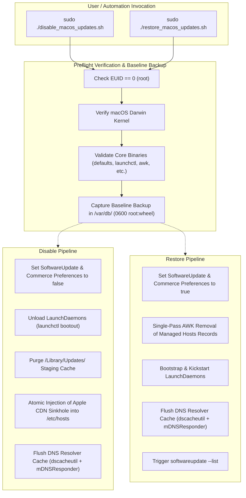

<!-- markdownlint-disable-file MD033 MD041 -->

<div align="center">

# 🔒 Disable-MacOS-Updates

## Control macOS Automatic Software Updates with Clean Reversibility

[](https://github.com/alsyundawy/Disable-MacOS-Updates/releases)
[](https://www.gnu.org/software/bash/)
[](https://apple.com/macos)
[%20%26%20Intel-f59e0b?style=for-the-badge&logo=apple&logoColor=white>)](https://apple.com)
[](LICENSE)
[-success?style=for-the-badge&logo=shellcheck&logoColor=white>)](https://www.shellcheck.net/)
[](DOCNOTE.md)

<p align="center">
  A pair of Bash scripts to disable macOS automatic software updates and symmetrically restore them when needed.
</p>

> Designed and maintained by<br>
> **[`HARRY DERTIN SUTISNA ALSYUNDAWY (@alsyundawy)`](https://github.com/alsyundawy)** —<br>
> Built for audio/video workstations (DAW), render systems, and machines where automatic updates cause disruptions.
>
> 📦 **[`GitHub Releases`](https://github.com/alsyundawy/Disable-MacOS-Updates/releases)** &nbsp;|&nbsp;
> 📖 **[`Operations Manual`](MANUAL.md)** &nbsp;|&nbsp;
> 🏛️ **[`Architecture & Engineering Notes`](DOCNOTE.md)** &nbsp;|&nbsp;
> 📜 **[`Full Changelog`](CHANGELOG.md)** &nbsp;|&nbsp;
> 💖 **[`Support via PayPal`](https://www.paypal.me/alsyundawy)** &nbsp;|&nbsp;
> 🇮🇩 **[`QRIS Donation`](#support--donation)**

</div>

---

## 🧭 Navigation

- [Overview](#overview)
- [Why Use These Scripts?](#why-use-these-scripts)
- [Key Features](#key-features)
- [Architecture & Execution Pipeline](#architecture--execution-pipeline)
- [Apple CDN Domains & Sinkhole Mapping](#apple-cdn-domains--sinkhole-mapping)
- [Compatibility & Architecture Matrix](#compatibility--architecture-matrix)
- [Quick Start & Operational Workflow](#quick-start--operational-workflow)
- [Automation & Fleet Deployment](#automation--fleet-deployment)
- [Quality Assurance & Verification](#quality-assurance--verification)
- [Engineering Standards & Invariants](#engineering-standards--invariants)
- [Security & File Permissions](#security--file-permissions)
- [Project Directory Structure](#project-directory-structure)
- [Contributing](#contributing)
- [Maintainer & Contact](#maintainer--contact)
- [Support & Donation](#support--donation)
- [License](#license)

---

## Overview

In audio production (DAW), video rendering, database hosting, and staging environments, an unprompted operating system update or unexpected reboot can interrupt render queues or break audio plugin drivers (AU, VST, AAX).

While macOS System Settings provides toggles, background daemon tasks and catalog indexing mechanisms often bypass these preferences, triggering update notifications or silent background downloads.

**Disable-MacOS-Updates** addresses this with two scripts:

1. **`disable_macos_updates.sh`**: Disables update discovery, background downloads, automated installation, unloads background launch daemons, purges update cache files, and sinkholes Apple CDN domains to `127.0.0.1` in `/etc/hosts`.
2. **`restore_macos_updates.sh`**: Reverts all system defaults, purges sinkhole entries without touching custom hosts records, reloads launch daemons, flushes local resolver caches, and re-triggers update availability.

---

## Why Use These Scripts?

### 1. CDN Sinkholing via /etc/hosts

- **Loopback Mapping**: Redirects Apple update catalog and package distribution hostnames (`swscan.apple.com`, `swdownload.apple.com`, `swcdn.apple.com`, `updates-http.cdn-apple.com`) to `127.0.0.1`.
- **Zero App Store Disruption**: Leaves normal Mac App Store manual downloads and iCloud services operational.

### 2. Atomic Hosts File Updates

- **Race-Free Replacement**: Writes hosts modifications to an isolated temporary file, applies permissions (`0644 root:wheel`), and commits changes atomically via `mv -f`.
- **Tagged Records**: Every injected line carries a `# disable_macos_updates:managed` tag. The restoration script removes **only** managed entries in a single awk pass, preserving all user-defined and third-party hosts records.

### 3. macOS Sandbox & $TMPDIR

- **Session Sandbox Compliance**: Uses per-session sandbox directory conventions (`/var/folders/...`) via `mktemp "${TMPDIR:-/tmp}/hosts.XXXXXXXX"`, avoiding multi-user collision risks in global `/tmp`.
- **Baseline Backup**: Saves a baseline backup in `/var/db/` with `0600` root-only permissions prior to any changes.

### 4. Symmetrical Daemon Management

- **Modern Launchctl Addressing**: Interacts with services via domain target syntax (`system/<service-label>`), searching both `/Library/LaunchDaemons` and `/System/Library/LaunchDaemons`.
- **Symmetrical Recovery**: Restores `com.apple.softwareupdated`, `com.apple.mobile.softwareupdated`, `com.apple.storedownloadd`, `com.apple.InstallAssistantService`, and `com.apple.commerce`.

### 5. Native Execution

- **Native macOS Binaries**: Operates exclusively with native macOS tools (`defaults`, `launchctl`, `dscacheutil`, `mDNSResponder`, `awk`, `grep`). No Homebrew or external dependencies required.

---

## Key Features

| Capability                       | Technical Implementation                                                           | Benefit                                                                         |
| :------------------------------- | :--------------------------------------------------------------------------------- | :------------------------------------------------------------------------------ |
| **Preference Control**           | Sets 6 keys in `com.apple.SoftwareUpdate` & `com.apple.commerce` to `false`.       | Prevents background discovery, downloads, auto-restarts, and App Store updates. |
| **Atomic `/etc/hosts` Sinkhole** | Injects loopback mapping for 4 Apple CDN domains via `mktemp` and `rename(2)`.     | Blocks network-level update catalog checks if daemons trigger.                  |
| **Clean Rollback**               | Uses single-pass BSD `awk` to remove only `# disable_macos_updates:managed` lines. | Restores original hosts state without modifying other entries.                  |
| **Safe Process Substitution**    | Replaces unshielded pipelines with `while IFS= read -r ... done < <(...)`.         | Eliminates false-positive `set -o pipefail` script crashes.                     |
| **Sandbox `$TMPDIR` Compliance** | Uses `mktemp "${TMPDIR:-/tmp}/hosts.XXXXXXXX"` instead of global `/tmp`.           | Complies with macOS sandbox boundaries and avoids symlink race hazards.         |
| **Daemon Management**            | Unloads/reloads daemons via modern `launchctl bootout` / `bootstrap`.              | Prevents active memory daemons from initiating background update tasks.         |
| **Baseline Backups**             | Saves copies in `/var/db/` with `0600 root:wheel` permissions.                     | Provides disaster recovery back to the pre-script state.                        |

---

## Architecture & Execution Pipeline



---

## Apple CDN Domains & Sinkhole Mapping

When disabled, the following Apple update domains are mapped to `127.0.0.1`:

| Domain Name                  | Primary Function                                                |
| :--------------------------- | :-------------------------------------------------------------- |
| `swscan.apple.com`           | Software Update Catalog index and update manifest server        |
| `swdownload.apple.com`       | Primary CDN package asset download distribution endpoint        |
| `swcdn.apple.com`            | Asset delivery and delta update package distribution server     |
| `updates-http.cdn-apple.com` | HTTP/HTTPS content delivery endpoint for system update payloads |

---

## Compatibility & Architecture Matrix

| macOS Release            | Version Range |     Intel (x86_64)     |   Apple Silicon (arm64)   | Tested Status |
| :----------------------- | :------------ | :--------------------: | :-----------------------: | :-----------: |
| **macOS 12 Monterey**    | 12.0 – 12.7.6 |      ✅ Supported      |         ✅ M1, M2         |   Verified    |
| **macOS 13 Ventura**     | 13.0 – 13.7.1 |      ✅ Supported      |       ✅ M1, M2, M3       |   Verified    |
| **macOS 14 Sonoma**      | 14.0 – 14.7.2 |      ✅ Supported      |     ✅ M1, M2, M3, M4     |   Verified    |
| **macOS 15 Sequoia**     | 15.0 – 15.7.x |      ✅ Supported      |   ✅ M1, M2, M3, M4, M5   |   Verified    |
| **macOS 26 Tahoe**       | 26.0+         | ✅ Final Intel Release | ✅ M1, M2, M3, M4, M5, M6 |   Verified    |
| **macOS 27 Golden Gate** | 27.0+         |  ❌ Dropped by Apple   | ✅ M1, M2, M3, M4, M5, M6 |   Verified    |

---

## Quick Start & Operational Workflow

### 1. Disable Automatic Updates

```bash
# Clone the repository
git clone https://github.com/alsyundawy/Disable-MacOS-Updates.git
cd Disable-MacOS-Updates

# Execute disable script with superuser privileges
sudo ./disable_macos_updates.sh
```

### 2. Restore Automatic Updates

```bash
# Execute restore script with superuser privileges
sudo ./restore_macos_updates.sh
```

### 3. Verify Active Configuration

```bash
# Verify SoftwareUpdate preferences
defaults read /Library/Preferences/com.apple.SoftwareUpdate

# Verify /etc/hosts sinkhole entries
grep -i "disable_macos_updates" /etc/hosts

# Verify DNS resolution of update CDN
dscacheutil -q host -a name swscan.apple.com
```

---

## Automation & Fleet Deployment

### Jamf Pro Integration

Deploy `disable_macos_updates.sh` as a Jamf Script payload targeted at your computer group:

```bash
#!/bin/bash
# Jamf Pro Extension Attribute: Check Update Freeze State
if grep -q "# disable_macos_updates:managed" /etc/hosts; then
    echo "<result>Frozen</result>"
else
    echo "<result>Active</result>"
fi
```

### Munki Integration (`nopkg`)

Incorporate into Munki manifests using `installcheck_script` to evaluate `/etc/hosts` managed tags and `com.apple.SoftwareUpdate` preference states.

---

## Quality Assurance & Verification

The codebase adheres to static analysis and defensive shell engineering standards:

- **Trunk Check**: Clean pass across linters (`markdownlint`, `prettier`, `shellcheck`, `trufflehog`).
- **ShellCheck**: 0 warnings across all scripts with `--severity=style`.
- **Markdownlint**: Clean compliance with no unhandled violations.
- **POSIX / Bash 3.2 Compatibility**: Clean execution on macOS native `/bin/bash` without Bash 4+/5+ requirements.

---

## Engineering Standards & Invariants

Refer to [`DOCNOTE.md`](DOCNOTE.md) for full Architectural Decision Records (ADRs), low-level Darwin invariants, BSD `awk` regex interval quantifier specifications, and `$TMPDIR` sandboxing analysis.

---

## Security & File Permissions

- **Root Privilege Requirement**: Both scripts enforce root privilege verification (`EUID == 0`) before modifying system settings.
- **Atomic Operations**: All modifications to `/etc/hosts` are executed via atomic `rename(2)` syscalls (`mv -f`).
- **Argument Injection Protection**: All file path parameters utilize double-dash (`--`) delimiters to protect against path-injection.
- **Restrictive File Modes**: All backup files created in `/var/db/` are set to `0600 root:wheel`.

---

## Project Directory Structure

```text
Disable-MacOS-Updates/
├── .markdownlint.json         # Standalone Markdownlint configuration (VS Code / editors)
├── .markdownlint.yaml         # YAML Markdownlint configuration
├── .trunk/                    # Trunk linter suite configuration
├── CHANGELOG.md               # Semantic versioned changelog (Keep a Changelog standard)
├── DOCNOTE.md                 # Architecture, engineering guidelines, and ADRs
├── LICENSE                    # MIT License
├── MANUAL.md                  # Operations & Administration Manual
├── README.md                  # Project overview, architecture, and quick start guide
├── disable_macos_updates.sh   # Production disabler script
└── restore_macos_updates.sh   # Production restoration script
```

---

## Contributing

Contributions are welcome:

1. Fork the repository and create your feature branch (`git checkout -b feature/my-feature`).
2. Adhere to strict Bash 3.2+ compatibility (no Bash 4+ arrays or constructs).
3. Ensure all changes pass `trunk check` and `shellcheck --severity=style`.
4. Submit a Pull Request with a clear explanation of your changes.

---

## Maintainer & Contact

### Harry Dertin Sutisna Alsyundawy (@alsyundawy)

- 🌐 Website: [https://www.alsyundawy.com](https://www.alsyundawy.com)
- 💻 GitHub: [@alsyundawy](https://github.com/alsyundawy)
- 🐦 Twitter / X: [@alsyundawy](https://x.com/alsyundawy)
- 🏢 Organization: [WWW.ALSYUNDAWY.NET](https://www.alsyundawy.net)
- 📍 Location: DKI Jakarta, Indonesia

---

## Support & Donation

If these scripts are helpful for your setup, you can support development here:

- **PayPal**: [`https://www.paypal.me/alsyundawy`](https://www.paypal.me/alsyundawy)

### 🇮🇩 QRIS (Quick Response Code Indonesian Standard)

Scan the QRIS barcode below using any Indonesian mobile banking app (BCA, Mandiri, BRI, BNI, BSI, CIMB Niaga, Permata) or e-wallet (GoPay, OVO, DANA, LinkAja, ShopeePay):


- **Merchant / Account Name**: **ALSYUNDAWY IT SOLUTION**
- **NMID**: **`ID1020021153676`**
- **Direct Barcode Asset Link**: [`https://github.com/user-attachments/assets/a0126f28-6dde-43da-ba14-d7c9a27de0df`](https://github.com/user-attachments/assets/a0126f28-6dde-43da-ba14-d7c9a27de0df)
- **WhatsApp Confirmation**: [`+62 856-8515-212`](https://wa.me/628568515212)

---

## License

This project is licensed under the **MIT License** — see the [`LICENSE`](LICENSE) file for details.

Copyright (c) 2026 **Harry Dertin Sutisna Alsyundawy (alsyundawy)**.
